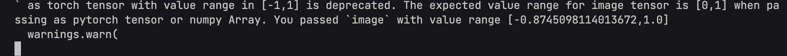

# Faster LCM

Faster LCM is a script which enables to transfer image styles at more than 30fps.

<p align="center">
  
</p>

## Installation

Build the docker image and run it:

```bash
make build && make run
```

## Usage

```bash
python3 calc_fps.py
```
